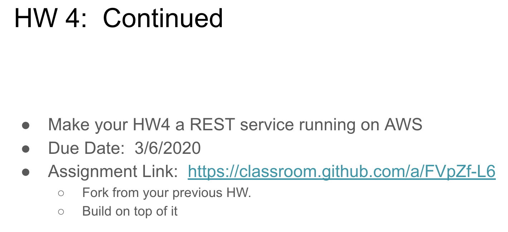
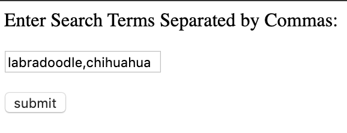

# EC500 Homework 5: Rest API
Justin Morgan's EC500 Homework 5 Repo

# Assignment Screenshot (For Easy Access)

# How Does it Work?
Simply run the file 'multiprocessing.py' and give it the search term arguments you want to search twitter for in quotes. An example image is given below. The program then collects all images and their respective captions, writes the captions on top of the images, and then creates a video of the images returned for each search term. For example, a command could be "python 'multiprocessing.py' 'labradoodle' 'tibetan mastiff' 'shiba inu'" The program
works best for search results that could typically return a lot of images, which is why I picked dogs as an example.

I AM NOT RESPONSIBLE FOR THE IMAGES RETURNED BY TWEEPY SEARCH. Salacious/Inappropriate content returned by the search for seemingly benign search terms is because the search goes by tweet text content. Twitter is full of NSFW content and so please be wary that inappropriate/weird images could be returned by the program. Sometimes the images have nothing to do with the search term because the tweet itself contained the term.

FOR THE REST API:
Navigate to the DNS address ec2-3-17-69-167.us-east-2.compute.amazonaws.com:8080 (SUBJECT TO CHANGE UPON STARTING INSTANCE)

# Example Image of REST API

